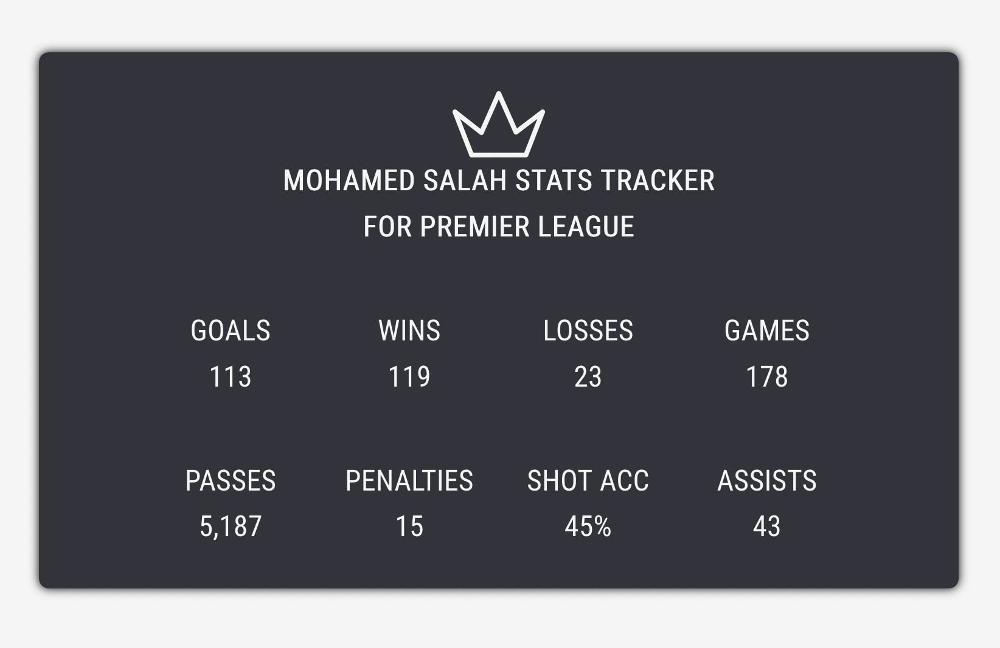

## Required Libraries

Selenium, Flask, python-dotenv

## Available Scripts

In the project directory, you can run:

### `npm start`

Runs the app in the development mode.\
Open [http://localhost:3000](http://localhost:3000) to view it in the browser.

The page will reload if you make edits.\
You will also see any lint errors in the console.

### `npm start-api`

Starts the flask server, run this before npm start.

